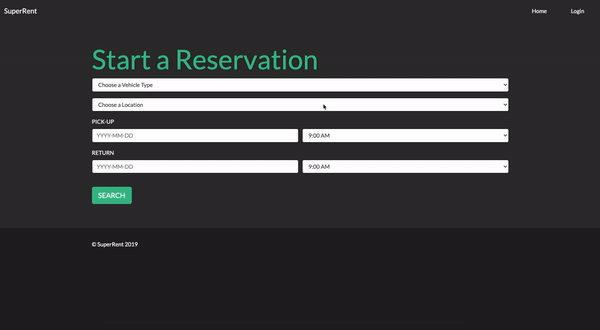

# CPSC 304 Project - SuperRent
Simple CRUD project for CPSC 304 (Introduction to Relational Databases) 
hosted with Heroku (using postgres)  
customer: https://safe-oasis-12638.herokuapp.com/index.php  
clerk: https://safe-oasis-12638.herokuapp.com/admin.php  
customer page links to clerk page via LOGIN (leave username and password blank) 

## Customer Transactions
Hit SEARCH to see all available, enter Vehicle Type only to see specific Vehicle Type, enter Location to see specific Location.
For the Reserve option to be available all of Vehicle Type, Location, and Branch must be selected (You will see a message indicating this if you have not chosen all options)  
When entering a new customer **remember the dlicense you enter**

## Clerk Transactions
To access this section hit the login button at the top right corner  
There is no username or password, simply hit login  
Now you have access to all the Clerk and Data Manipulation transactions  
**NOTE: The Daily/Branch Reports are functioning, if they appear empty then try adding Rentals/Returns for the next date (if today is Nov.24 try adding Nov.25) it seems that the heroku database does not match our timezone and we couldn't get the timezone functionality working in the code**  

## Queries in the Code  
All the queries interacting with the app can be found in lib/Vehicle.php  
